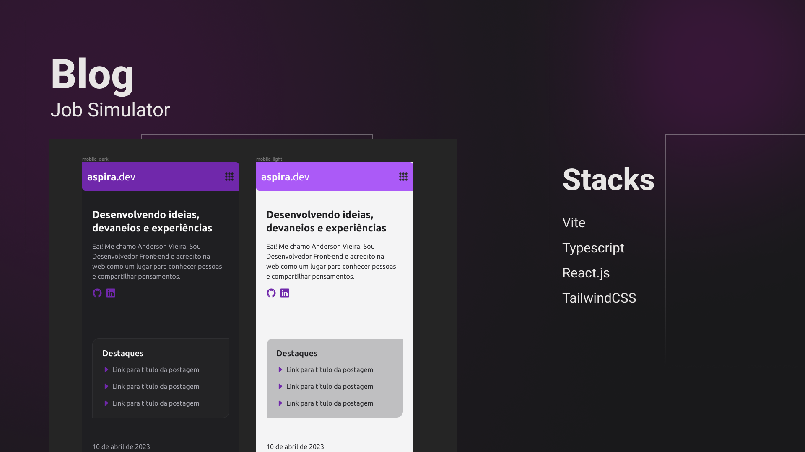

<h1 align="center"> aspira.dev </h1>

Em construção

Projeto de blog pessoal para compartilhar ideias e experiências.

  <a href="#Tecnologias">Tecnologias</a>&nbsp;&nbsp;&nbsp;|&nbsp;&nbsp;&nbsp;
  <a href="#Projeto">Projeto</a>&nbsp;&nbsp;&nbsp;|&nbsp;&nbsp;&nbsp;
  <a href="#Layout">Layout</a>&nbsp;&nbsp;&nbsp;|&nbsp;&nbsp;&nbsp;
  <a href="#Aprendizado">O que aprendi</a>

 

  

## Tecnologias

Esse projeto está sendo desenvolvido com as seguintes tecnologias:

- [HTML](https://developer.mozilla.org/pt-BR/docs/Web/HTML)
- [JavaScript](https://developer.mozilla.org/pt-BR/docs/Web/JavaScript)
- [React JS](https://react.dev/)
- [TailwindCSS](https://tailwindcss.com/)
- [Node e NPM](https://nodejs.org/)
- [Vite](https://vitejs.dev/)

## Projeto

O aspira.dev é uma aplicação SPA ([Single Page Application](https://en.wikipedia.org/wiki/Single-page_application)) que exibe publicações em formato de blog pessoal.

### Requisitos funcionais

- O usuário pode alternar o tema entre Claro e Escuro.

## Layout

Utilizei o Figma para construção dos componentes e montagem do layout.
[Acesso ao layout](https://www.figma.com/file/gsP5k3STLow8oVG1SRzbtb/blog?node-id=16-232&t=xHcFjmOjOXYcD4Xf-0)

## Aprendizado

- Em construção.

---

Feito por [Anderson Vieira](https://linkedin/in/vieira-a)
